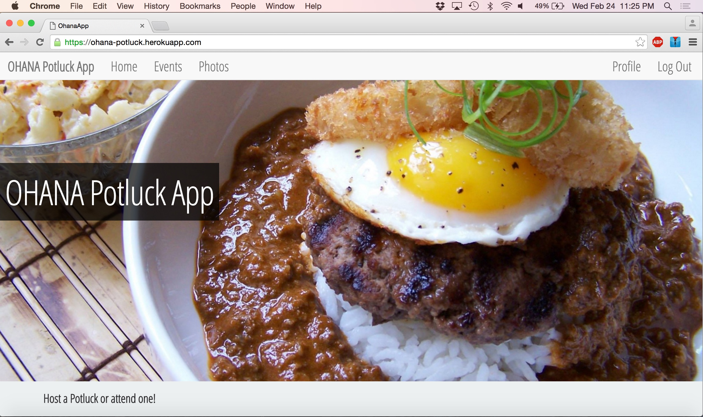
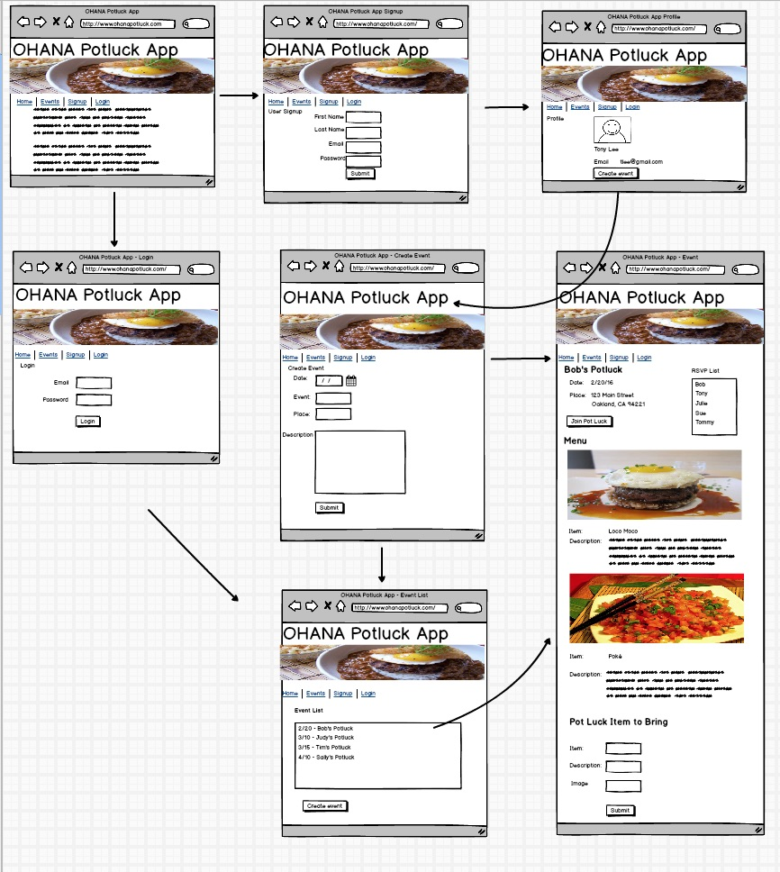
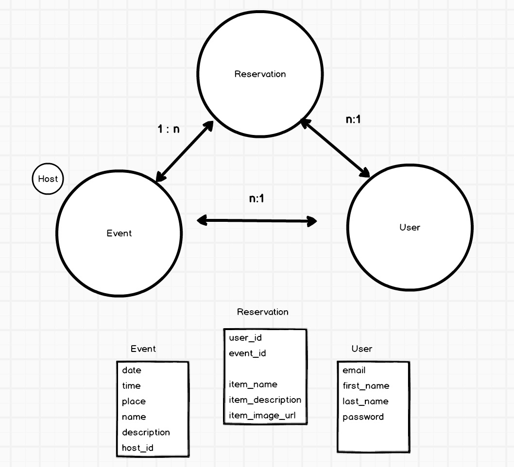

## OHANA Potluck App
The OHANA Potluck App allows a user to create and attend potlucks. When a user RSVP's for a potluck, they can submit a dish. Also, the user can host a potluck.

## Heroku
<a href="https://ohana-potluck.herokuapp.com/" target="_blank">OHANA Potluck App</a>

## Contents
* **[Screenshot](#screenshot):** OHANA Potluck App
* **[Wireframes](#wireframes):** Wireframes of my Project.
* **[Models](#models):** Models of my Project.
* **[User Stories](#user-stories):** User stories for my project.
* **[Heroku Link](#heroku-hosted-project):** Link to project on Heroku.
* **[Technologies](#technologies):** The Technologies, Libraries, and Frameworks Used.
* **[Installation](#installation):** How to Install OHANA Potluck App. 
* **[Future Development](#future-development):** What I am looking to improve in the future.


## OHANA Potluck App


## Wireframes


## Models


## User Stories
<a href="https://trello.com/b/ye3PcScB/potluck-app">Trello User Stories</a>

## Technologies
* Languages
  * Ruby on Rails
  * HTML5
  * CSS3
  * Javascript


* Gems
  * bcrypt
  * RSpec
  * Bootstrap Sass
  * JQuery-rails
  * httparty
  * MomentJS-Rails
  * Bootstrap 3 Datetimepicker Rails
  * Rails 12 Factor

* Libraries  
  * Bootstrap
  * JQuery  

* Database
  *  PostgreSQL

* Project Management
  * Trello
  * Balsmic

## Installation
* **Step 1**: Fork and clone this repository

* **Step 2**: Run the following commands in the terminal

```
bash
bundle install
rake db:create db:migrate
rails s
```

* **Step 3**: Go to localhost:3000 in your Web Browser  

## Future Development
* Allow the app to be more full-featured with email and add the Paperclip gem to allow users to upload pictures of dishes and for a profile picture.
*  Work on the Front-End to add more styling that is visually stunning and dynamic.
*  Work on adding more complexity in the logic to allow users to cap the amount of dishes for a potluck.